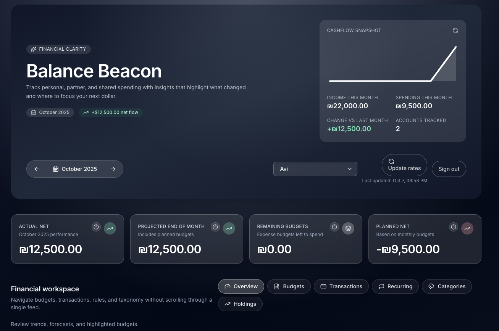
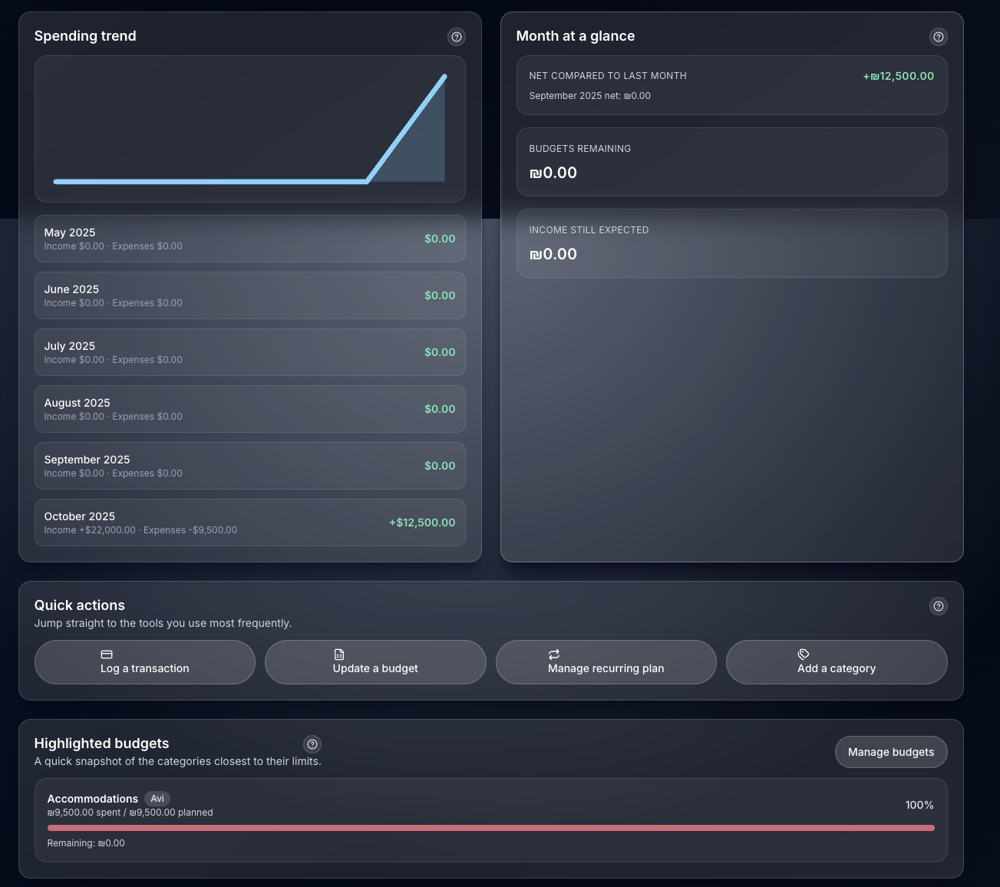
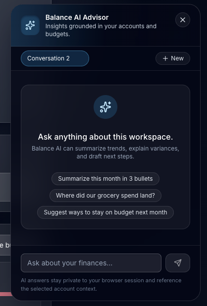
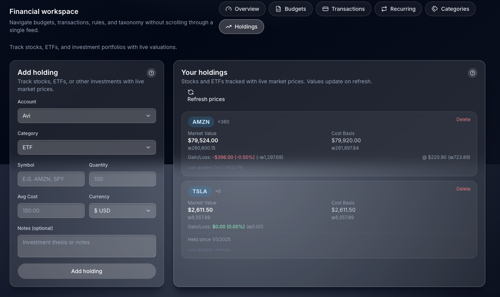
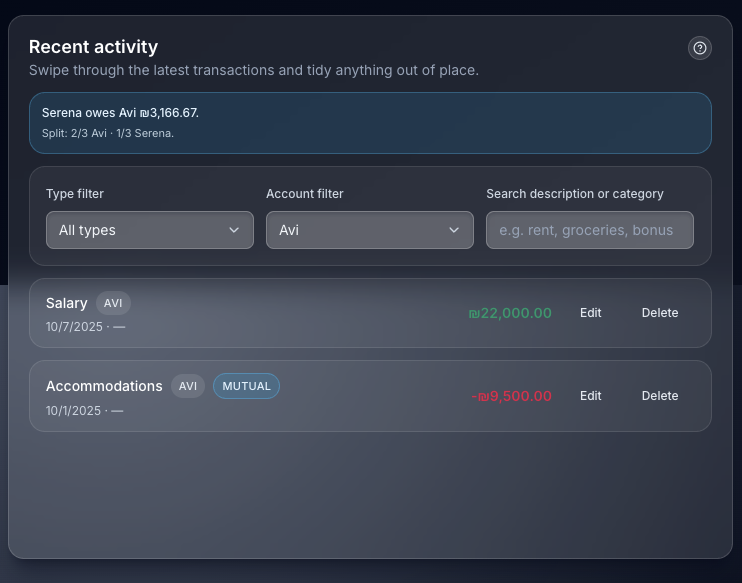

# Balance Beacon

Personal finance workspace for managing income, spending, shared budgets, and investments across multiple accounts (Self, Partner, Joint, Other). The dashboard keeps budgets, recurring obligations, investment holdings, and month-to-month performance together so you can replace manual spreadsheets.

## Screenshots

### Dashboard Overview

*Main dashboard with financial clarity metrics, cashflow snapshot, and monthly stats*

### Spending Trends & Budgets

*Monthly spending trends, quick actions, and highlighted budget tracking*

### AI Financial Advisor

*Chat with Claude to analyze spending, add transactions, and get insights*

### Investment Holdings

*Track stocks and ETFs with live market prices and portfolio performance*

### Transaction Management

*Recent activity with mutual expense tracking and filtering*

## Features

- 🔁 **Recurring Templates** - Permanent transaction plans with one-click application into the current month
- 💰 **Multi-Account Budgets** - Track budgets per account & category with live progress and remaining allowances
- 📈 **Financial Trends** - Month-to-month net results, income vs. expense trends, and sparkline visualizations
- 📂 **Flexible Categories** - Archive/reactivate categories without losing transaction history
- 🧾 **Fast Transaction Entry** - Quick forms for expenses and earnings with recurring flagging
- 💱 **Multi-Currency Support** - Track finances in USD, EUR, and ILS with automatic exchange rate conversion
- 🤝 **Mutual Expenses** - Flag and track shared expenses between partners
- 📊 **Investment Holdings** - Track stocks, ETFs, and other investments with live market prices
- 🤖 **AI Financial Advisor** - Natural language financial assistant powered by AWS Bedrock (Claude Sonnet 4.5)
  - Add transactions via chat ("Add coffee $5 today")
  - Analyze spending patterns and trends
  - Query historical data
  - Get cashflow forecasts
  - Portfolio analysis

## Tech Stack

- [Next.js 15 App Router](https://nextjs.org/docs/app) with Server Actions
- TypeScript + Tailwind CSS UI primitives
- [Prisma ORM](https://www.prisma.io/) with PostgreSQL (Neon)
- [AWS Bedrock](https://aws.amazon.com/bedrock/) with Claude Sonnet 4.5
- [Vercel AI SDK](https://sdk.vercel.ai/) for streaming AI responses
- [Alpha Vantage API](https://www.alphavantage.co/) for stock prices
- [Frankfurter API](https://www.frankfurter.app/) for exchange rates
- Zod validation on all server mutations
- bcryptjs authentication with session cookies

## Prerequisites

- Node.js **18.18+** (recommended Node 20 LTS). Server Actions and the Prisma client both require modern Node. Use `nvm`, `fnm`, or Volta to switch locally if needed.
- npm 9+ (ships with current Node). Yarn/pnpm work too if you prefer.
- A PostgreSQL database (Neon, Supabase, Render, or local Postgres all work).

## Local Setup

### Quick start

```bash
npm run setup:local
```

The script installs dependencies (if needed), writes `.env` with local defaults, boots the Dockerized Postgres instance, syncs Prisma schema, and seeds starter data. When it completes, start the dev server with `npm run dev` (the database stays running).

### Manual steps

1. **Install dependencies**
   ```bash
   npm install
   ```

2. **Configure environment variables**
   ```bash
   cp .env.example .env
   ```

   **Required variables:**
   - `DATABASE_URL` - Postgres connection string (Neon includes `sslmode=require`)
   - `AUTH_SESSION_SECRET` - Session signing secret (generate with `openssl rand -hex 32`)
   - `AUTH_USER1_EMAIL`, `AUTH_USER1_DISPLAY_NAME`, `AUTH_USER1_PASSWORD_HASH`, `AUTH_USER1_PREFERRED_CURRENCY`
   - `AUTH_USER2_EMAIL`, `AUTH_USER2_DISPLAY_NAME`, `AUTH_USER2_PASSWORD_HASH`, `AUTH_USER2_PREFERRED_CURRENCY`
   - `ALPHA_VANTAGE_API_KEY` - Free API key from [alphavantage.co](https://www.alphavantage.co/support/#api-key) for stock prices
   - `AWS_BEDROCK_ACCESS_KEY_ID`, `AWS_BEDROCK_SECRET_ACCESS_KEY`, `AWS_BEDROCK_REGION` - AWS credentials for AI features

   **Optional variables:**
   - `NEXT_PUBLIC_APP_URL` - Base URL for absolute links
   - `NEXT_PUBLIC_AI_ENABLED` - Enable/disable AI chat widget (default: true)
   - `STOCK_PRICE_MAX_AGE_HOURS` - Stock price cache duration (default: 24)

   **Generate password hashes:**
   ```bash
   node -e "const bcrypt = require('bcryptjs'); bcrypt.hash('YOUR_PASSWORD', 12, (err, hash) => console.log(hash));"
   ```

3. **Start a local Postgres instance (optional)**
   If you don’t already have Postgres running, the repo ships with a Docker compose file:
   ```bash
   npm run db:up:local
   # follow logs (Ctrl+C to detach)
   npm run db:logs:local
   ```
   Credentials default to `postgres:postgres` with the database `expense_track`. Adjust `.env.docker` if you need different values.

4. **Prepare the database schema**
   Choose one of:
   - Use migrations (recommended once you have a persistent DB):
     ```bash
     npx prisma migrate dev --name init
     ```
   - For a throwaway dev database, push the schema directly:
     ```bash
     npm run db:push
     ```

5. **Seed core data** (creates the three base accounts and starter categories):
   ```bash
   npm run db:seed
   ```

6. **Generate the Prisma client** (runs automatically on `npm install`, but kept for completeness):
   ```bash
   npm run prisma:generate
   ```

7. **Start the dev server**
   ```bash
   npm run dev
   ```
   Or run everything (boot Postgres + dev server) in one go:
   ```bash
   npm run dev:local
   ```
   Visit [http://localhost:3000](http://localhost:3000) to use the dashboard.

8. **Stop the local database**
   ```bash
   npm run db:down:local
   ```

## Deployment (Vercel + Neon)

1. Push this repository to GitHub/GitLab
2. In Vercel, import the project and choose the `main` branch (App Router detected automatically)
3. Add environment variables in the Vercel dashboard:

   **Required:**
   - `DATABASE_URL` – Production Postgres URL (Neon free tier recommended)
   - `AUTH_SESSION_SECRET` – Random 64-char hex string (`openssl rand -hex 32`)
   - `AUTH_USER1_EMAIL`, `AUTH_USER1_DISPLAY_NAME`, `AUTH_USER1_PASSWORD_HASH`, `AUTH_USER1_PREFERRED_CURRENCY`
   - `AUTH_USER2_EMAIL`, `AUTH_USER2_DISPLAY_NAME`, `AUTH_USER2_PASSWORD_HASH`, `AUTH_USER2_PREFERRED_CURRENCY`
   - `ALPHA_VANTAGE_API_KEY` – Stock price API key
   - `AWS_BEDROCK_ACCESS_KEY_ID`, `AWS_BEDROCK_SECRET_ACCESS_KEY`, `AWS_BEDROCK_REGION` – AI credentials

   **Optional:**
   - `NEXT_PUBLIC_APP_URL` – e.g. `https://your-app.vercel.app`
   - `NEXT_PUBLIC_AI_ENABLED` – Set to `false` to disable AI features
   - `STOCK_PRICE_MAX_AGE_HOURS` – Stock cache duration (default: 24)

4. (Optional) Wire up the [Vercel-Neon integration](https://vercel.com/integrations/neon) for automatic `DATABASE_URL` setup
5. Trigger a production deploy. The build runs `npm run build`, which executes `prisma generate` and migrations automatically

**Note:** When copying bcrypt password hashes to Vercel, the `$` characters may get escaped to `\$` - the app automatically handles this conversion.

Detailed, step-by-step notes live in [`docs/vercel-deployment.md`](docs/vercel-deployment.md).

## Database Model

- **Account** – Self, Partner, Joint, or Other account types with optional preferred currency
- **Category** – Income or Expense groupings, soft-archived when no longer needed; supports holding categories for investments
- **Transaction** – Individual earnings/expenses with month snapshots, multi-currency support, mutual expense tracking, and optional recurring linkage
- **Budget** – Planned spend/earn for a category + account in a given month with currency support
- **RecurringTemplate** – Permanent plan definitions that can be applied into transactions each month
- **Holding** – Investment holdings (stocks, ETFs) with quantity, average cost, and symbol tracking per account-category
- **StockPrice** – Cached stock prices from Alpha Vantage with 24-hour TTL
- **ExchangeRate** – Cached currency exchange rates from Frankfurter API (EUR, USD, ILS)

## Common Workflows

- **Budget Tracking** - Add budgets for the month from the "Monthly Budgets" card, then capture spending as it happens
- **Recurring Payments** - Save rent/salary/etc. as permanent plans. At the start of each month, hit "Apply to {Month}" to pre-populate them
- **Account Filtering** - Switch between **All**, **Self**, **Partner**, and **Joint** using the account selector to focus on one ledger
- **Investment Tracking** - Add holdings in the Holdings tab with stock symbols, track live prices, and see portfolio performance
- **Multi-Currency** - Set preferred currency per account; exchange rates auto-convert for accurate totals
- **Mutual Expenses** - Flag transactions as mutual to track shared expenses between partners
- **AI Assistant** - Click the chat widget to ask questions like "How much did we spend on groceries?" or "Add coffee $5 today"

## Scripts Reference

| Command | Description |
| --- | --- |
| `npm run setup:local` | One-shot setup: install deps, create .env, boot Docker Postgres, sync schema, seed data |
| `npm run dev` | Start the Next.js dev server |
| `npm run dev:local` | Boot Docker Postgres + start dev server together |
| `npm run build` | Production build with type-checking |
| `npm run start` | Start the compiled production server |
| `npm run lint` | Run ESLint |
| `npm test` | Run Vitest unit tests |
| `npm run test:e2e` | Run Playwright e2e tests |
| `npm run prisma:generate` | Regenerate Prisma client types |
| `npm run db:up:local` | Start Docker Postgres container |
| `npm run db:down:local` | Stop and remove Docker Postgres container |
| `npm run db:logs:local` | Follow database logs |
| `npm run db:push` | Push Prisma schema to the configured database (dev only) |
| `npm run db:migrate` | Apply pending migrations (production) |
| `npm run db:seed` | Seed baseline accounts and categories |

## Authentication

Balance Beacon uses session-based authentication with bcrypt password hashing:
- Two users configured via environment variables (no database user table)
- Signed session cookies (`balance_session`, `balance_user`, `balance_account`)
- Account access control - users can only modify accounts in their `accountNames` array
- Sessions are stateless; re-login required if cookies expire
- Password hashes are auto-unescaped for Vercel compatibility

## API Integrations

- **Alpha Vantage** - Stock prices with 25 calls/day limit (free tier), throttled to 5 calls/minute
- **Frankfurter** - Exchange rates (EUR, USD, ILS) with 24-hour caching
- **AWS Bedrock** - Claude Sonnet 4.5 for AI financial assistance (~$2-5/month for 2 users)

## Next Steps & Ideas

- Add PDF export for monthly reports
- Create analytics widgets (cash flow by quarter, category trends, partner split)
- Automate monthly rollovers for recurring templates on the 1st
- Add support for more currencies (GBP, CAD, JPY, etc.)
- Implement transaction import from CSV/bank feeds
- Add notifications for budget overruns

Enjoy running your finances without juggling multiple spreadsheets! For issues or feature requests, open a GitHub issue.
